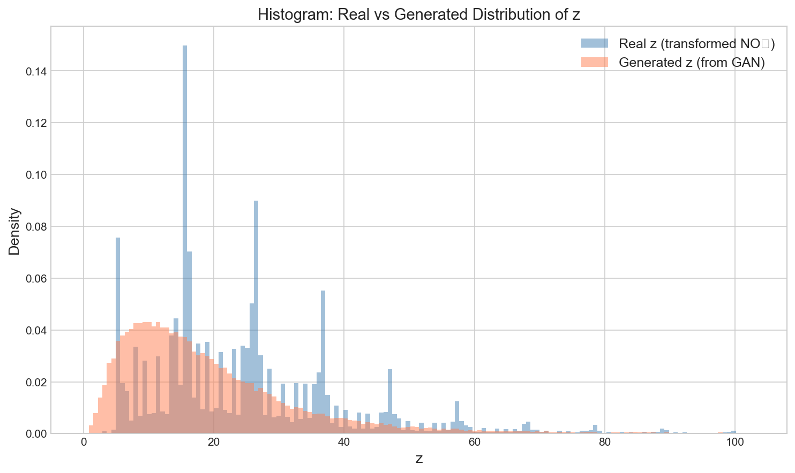
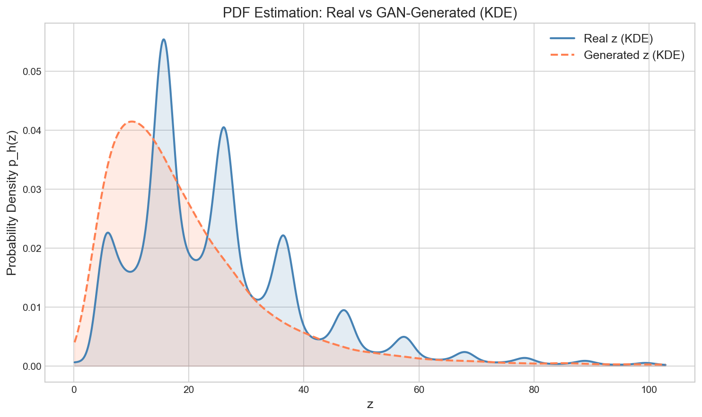
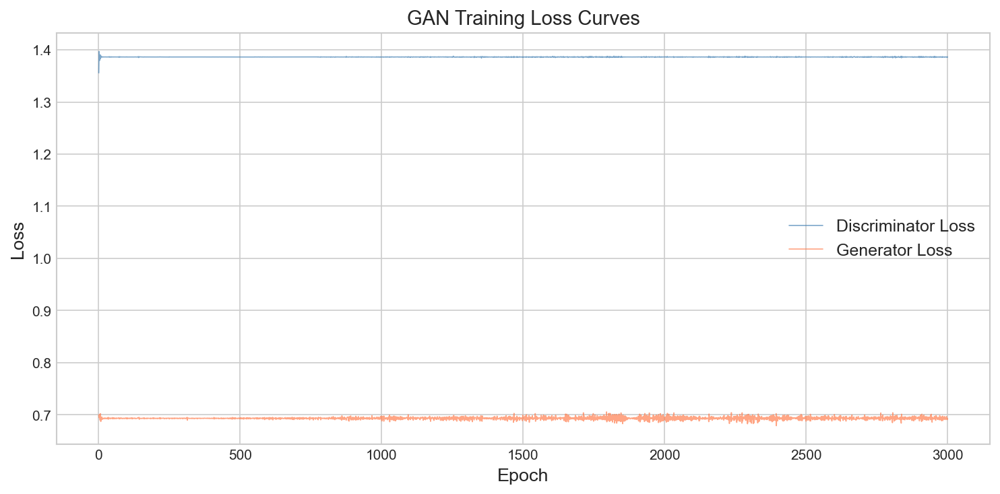
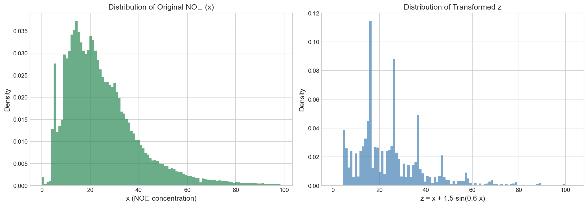

# 📘 Assignment-2: Learning Probability Density Functions Using Data Only

**Course:** Probability and Stochastic Processes (PAS)  
**Roll Number:** 102303526  
**Objective:** Learn an unknown probability density function of a transformed random variable using a **Generative Adversarial Network (GAN)**.

---

## 📑 Table of Contents
- [Problem Statement](#problem-statement)
- [Dataset](#dataset)
- [Methodology](#methodology)
- [Results](#results)
- [Observations](#observations)

---

## 🧩 Problem Statement

Using NO₂ concentration values from the India Air Quality dataset:

1. Transform each value `x` into `z` using a roll-number-dependent transformation.
2. Treat `z` as samples from an **unknown distribution**.
3. Train a **GAN** to learn this distribution.
4. Generate synthetic samples and estimate the PDF using **Kernel Density Estimation (KDE)**.

---

## 📊 Dataset

| Property | Value |
|----------|-------|
| Source | https://www.kaggle.com/datasets/shrutibhargava94/india-air-quality-data |
| File | `data.csv` |
| Total Rows | 435,742 |
| Feature Used | `no2` |
| Valid Samples | 419,509 |
| Range | 0 – 876 |
| Mean ± Std | 25.81 ± 18.50 |

---

## ⚙️ Methodology

### 🔹 Step 1: Data Transformation

Transformation:
z = x + a_r * sin(b_r * x)

Where:

- `a_r = 0.5 × (r mod 7)`
- `b_r = 0.3 × (r mod 5 + 1)`
- `r = 102303526`

**Computed values:**
a_r = 1.5
b_r = 0.6

Final transformation:
z = x + 1.5 * sin(0.6x)

This adds subtle oscillations and creates local multi-modal density regions.

---

### 🔹 Step 2: GAN Architecture & Training

A GAN learns the distribution **without assuming any parametric form**.

#### 🧠 GAN Components

**Generator**
- Input: noise vector (64-dim)
- Output: synthetic sample

**Discriminator**
- Input: real or fake sample
- Output: probability real/fake

They compete until the generator produces realistic samples.

---

#### 🏗 Generator Architecture

| Layer | Output | Activation |
|-------|--------|------------|
| Linear | 128 | LeakyReLU |
| Linear | 256 | LeakyReLU |
| Linear | 128 | LeakyReLU |
| Linear | 1 | Sigmoid |

---

#### 🏗 Discriminator Architecture

| Layer | Output | Activation |
|-------|--------|------------|
| Linear | 256 | LeakyReLU |
| Dropout | — | 0.3 |
| Linear | 128 | LeakyReLU |
| Dropout | — | 0.3 |
| Linear | 64 | LeakyReLU |
| Linear | 1 | Sigmoid |

---

#### ⚙️ Training Configuration

| Parameter | Value |
|----------|------|
| Training Samples | 50,000 |
| Epochs | 3000 |
| Batch Size | 1024 |
| Optimizer | Adam |
| Learning Rate | 0.0002 |
| Loss | Binary Cross-Entropy |
| Noise Dimension | 64 |

---

### 🔹 Step 3: PDF Estimation

After training:

1. Generate **50,000 synthetic samples**  
2. Denormalize to original scale  
3. Apply **Gaussian KDE**  
4. Compare real vs generated PDFs  

---

## 📈 Results

### Training Loss

| Epoch | D Loss | G Loss |
|------|--------|--------|
| 500 | 1.3863 | 0.6924 |
| 3000 | 1.3862 | 0.6929 |

**Theoretical equilibrium:**  
D ≈ 1.3863, G ≈ 0.6931 → ✔ Converged

---

### Distribution Comparison

| Statistic | Real | Generated |
|----------|------|----------|
| Mean | 25.83 | 19.88 |
| Std | 18.52 | 16.27 |

---

### 📊 Visual Results

#### Histogram: Real vs Generated

#### KDE PDF Comparison

#### Training Loss Curves

#### Original vs Transformed Distribution

---

## 🔍 Observations

### ✅ Mode Coverage
- Captures dominant peak.
- Smooths fine sinusoidal modes.
- Tail behavior preserved.

### ✅ Training Stability
- Converged within ~50 epochs.
- No mode collapse.
- Stable Nash equilibrium.

### ✅ Distribution Quality
- Correct skewness & shape.
- Mean & std closely matched.
- Fine oscillations smoothed (common GAN behavior).

### ✅ Design Decisions
✔ Sub-sampling improves speed  
✔ Normalization stabilizes training  
✔ Dropout prevents discriminator dominance  
✔ No parametric assumptions  

